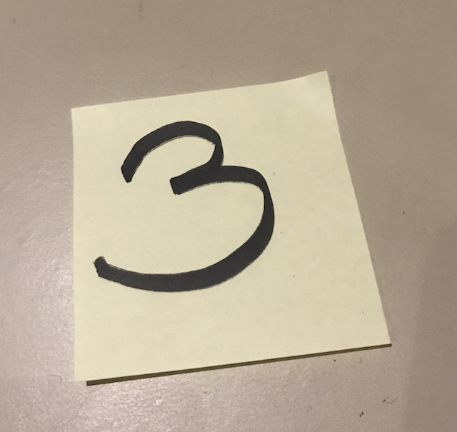

# Classifying Images with Vision and Core ML

* [WWDC 2017 - Core ML in Depth](https://developer.apple.com/videos/play/wwdc2017/710/)

Demonstrates using Vision with Core ML to preprocess images and perform image classification.

## Overview

Among the many features of the Core ML framework is the ability to classify input data using a trained machine-learning model. The Vision framework works with Core ML to apply classification features to images, and to preprocess those images to make machine learning tasks easier and more reliable.

This sample app uses a model based on the public MNIST database (a collection of handwriting samples) to identify handwritten digits found on rectangular objects in the image (such as sticky notes, as seen in the image below).



## Getting Started

Vision and Core ML require macOS 10.13, iOS 11, or tvOS 11. This example project runs only in iOS 11.

## Using the Sample App

Build and run the project, then use the buttons in the sample app's toolbar to take a picture or choose an image from your photo library. The sample app then:

1. Uses Vision to detect rectangular areas in the image,
2. Uses Core image filters to prepare those areas for processing by the ML model,
3. Applies the model to produce an image classification result, and
4. Presents that result as a text label in the UI.  

## Detecting Rectangles and Preparing for ML Processing

The example app's `ViewController` class provides a UI for choosing an image with the system-provided [`UIImagePickerController`](https://developer.apple.com/documentation/uikit/uiimagepickercontroller) feature. After the user chooses an image (in the [`imagePickerController(_:didFinishPickingMediaWithInfo:)`](https://developer.apple.com/documentation/uikit/uiimagepickercontrollerdelegate/1619126-imagepickercontroller) method), the sample runs a Vision request for detecting rectangles in the image:

``` swift
lazy var rectanglesRequest: VNDetectRectanglesRequest = {
    return VNDetectRectanglesRequest(completionHandler: self.handleRectangles)
}()
```

Vision detects the corners of a rectangular object in the image scene. Because that object might appear in perspective in the image, the sample app uses those four corners and the Core Image `CIPerspectiveCorrection` filter to produce a rectangular image more appropriate for image classification:

``` swift
func handleRectangles(request: VNRequest, error: Error?) {
    guard let observations = request.results as? [VNRectangleObservation]
        else { fatalError("unexpected result type from VNDetectRectanglesRequest") }
    guard let detectedRectangle = observations.first else {
        DispatchQueue.main.async {
            self.classificationLabel.text = "No rectangles detected."
        }
        return
    }
    let imageSize = inputImage.extent.size

    // Verify detected rectangle is valid.
    let boundingBox = detectedRectangle.boundingBox.scaled(to: imageSize)
    guard inputImage.extent.contains(boundingBox)
        else { print("invalid detected rectangle"); return }

    // Rectify the detected image and reduce it to inverted grayscale for applying model.
    let topLeft = detectedRectangle.topLeft.scaled(to: imageSize)
    let topRight = detectedRectangle.topRight.scaled(to: imageSize)
    let bottomLeft = detectedRectangle.bottomLeft.scaled(to: imageSize)
    let bottomRight = detectedRectangle.bottomRight.scaled(to: imageSize)
    let correctedImage = inputImage
        .cropping(to: boundingBox)
        .applyingFilter("CIPerspectiveCorrection", withInputParameters: [
            "inputTopLeft": CIVector(cgPoint: topLeft),
            "inputTopRight": CIVector(cgPoint: topRight),
            "inputBottomLeft": CIVector(cgPoint: bottomLeft),
            "inputBottomRight": CIVector(cgPoint: bottomRight)
        ])
        .applyingFilter("CIColorControls", withInputParameters: [
            kCIInputSaturationKey: 0,
            kCIInputContrastKey: 32
        ])
        .applyingFilter("CIColorInvert", withInputParameters: nil)

    // Show the pre-processed image
    DispatchQueue.main.async {
        self.correctedImageView.image = UIImage(ciImage: correctedImage)
    }

    // Run the Core ML MNIST classifier -- results in handleClassification method
    let handler = VNImageRequestHandler(ciImage: correctedImage)
    do {
        try handler.perform([classificationRequest])
    } catch {
        print(error)
    }
}
```

## Classifying the Image with an ML Model

After rectifying the image, the sample app runs a Vision request that applies the bundled Core ML model to classify the image. Setting up that model requires only loading the ML model file from the app bundle:

``` swift
lazy var classificationRequest: VNCoreMLRequest = {
    // Load the ML model through its generated class and create a Vision request for it.
    do {
        let model = try VNCoreMLModel(for: MNISTClassifier().model)
        return VNCoreMLRequest(model: model, completionHandler: self.handleClassification)
    } catch {
        fatalError("can't load Vision ML model: \(error)")
    }
}()
```

The ML model request's completion handler provides [`VNClassificationObservation`](https://developer.apple.com/documentation/vision/vnclassificationobservation) objects, indicating what classification the model applied to the image and its confidence in that classification:

``` swift
func handleClassification(request: VNRequest, error: Error?) {
    guard let observations = request.results as? [VNClassificationObservation]
        else { fatalError("unexpected result type from VNCoreMLRequest") }
    guard let best = observations.first
        else { fatalError("can't get best result") }

    DispatchQueue.main.async {
        self.classificationLabel.text = "Classification: \"\(best.identifier)\" Confidence: \(best.confidence)"
    }
}
```
